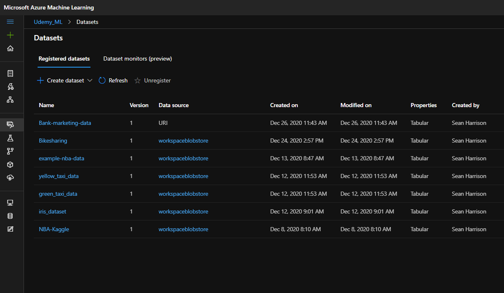
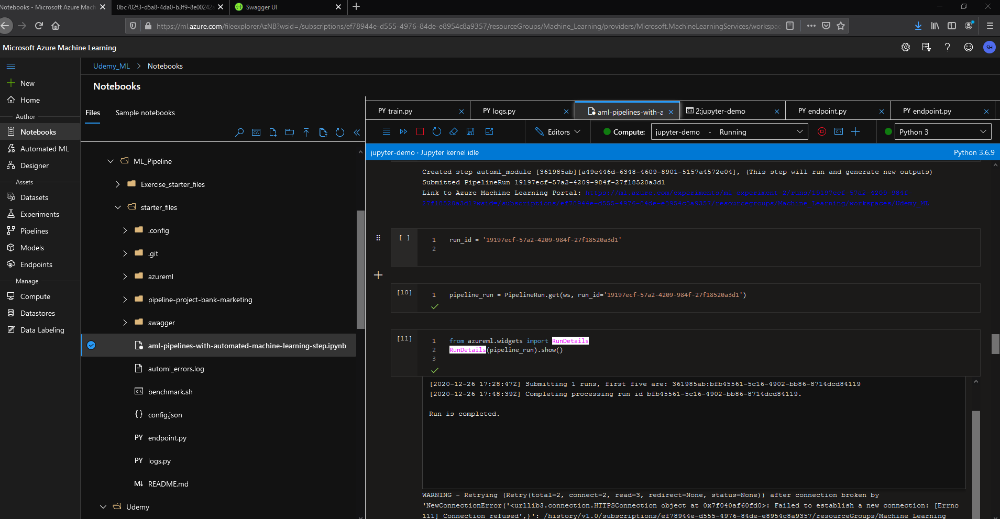

# Operationalizing Machine Learning with Azure ML 

The objective in this project is to leverage Azure and Azure ML studio to configure a cloud-based ML production model, deloy the model, create the endpoint, and consume the model endpoints via REST API calls.

## Architectural Diagram

Select the link below to view the architectural diagram

## Screenshots 

Screen shots for Deploy model in Azure ML studio:

Create a new AutoML run:
* “Registered Datasets” in ML Studio shows "Bankmarketing" dataset available

* The experiment is shown as completed

Deploy model and consume endpoint via HTTP API:
* Endpoints section in Azure ML Studio, showing that “Application Insights enabled” says “true”

* Logging is enabled by running the provided logs.py script

* Swagger runs on localhost showing the HTTP API methods and responses for the model

* endpoint.py script runs against the API producing JSON output from the model.

Publish an ML Pipeline:
Create and publish a pipeline:
* The pipeline section of Azure ML studio, showing that the pipeline has been created

* The Bankmarketing dataset with the AutoML module

* The “Published Pipeline overview”, showing a REST endpoint and a status of ACTIVE

Configure a pipeline w/ SDK
* A screenshot of the Jupyter Notebook is included in the submission showing the “Use RunDetails Widget” with the step runs

Use REST endpoint to interact with Pipeline
* ML studio showing the pipeline endpoint as Active

* ML studio showing the scheduled run

The key steps in the model are:

Authentication - is the process of confirming the identiy of person or authenticity of a process attempting to access a system. It is critical for the continuous flow of operations in a CI/CD system.
Build Auto-ML Model - is the process of using AutoML to automate the time consuming, iterative task of ML model development
Deploy the best model - selecting from a experiment the model with the best performance based on the metric (e.g. Accuracy) defined to deploy to production
Enable Logging and Appication Insights - Logging is capturing informational output produced by the software and Application Insights is an Azure service which provides key facts about an application
Consume model endpoints - other services interact with deployed models by using endpoints 
Create and publish pipelines - pipelines are a way to automate workflows so the ML lifecycle can be managed more efficiently
Document - Documentation allows others to better understand the architecture, implementation, and coding detils for a ML project

## Key Steps
Below are specific steps performend at each stage in the process.  

# Authentication
The steps are:
* Make sure "az" is installed and enabled in the terminal
* "az login" succeeded
* create the SP (if permissions allow)
* "az ml workspace share" completes without errors
* "az ad sp create-for-rbac..." succeeded
* Capture "object-id" using the "clientID"
* "az ml workspace share... " to allow the SP to access workspace succeeded

Note: Due to restrictions related to how my role is configured in Azure, I was unable to create a Service Principal. 

# Build Auto-ML Model
The steps are:
* Create experiment
* Attache compute
* Select dataset
* Define automl config
* Create the pipeline and automl steps
* Run the pipeline

# Deploy the best model
Several key steps required to deploy a model are:
* Select a previoulsy trained model
* Complete the deployment form 
* Enable Authentication
* Select or create a compute cluster
* Select an ACI or AKS container 
* Verify the deploy status is successful

# Enable Logging and application Insights
Several key steps to enable logging and application insights:
* Enable application insights via SDK
* run: service.update(enable_app_insights=True)
* run: logs = service.get_logs()
* verify in AzureML studio for an endpoint that Application Insights enabled field is true

# Consume Model Endpoints
Several key steps to view API are:
* Select the model from Azure ML studio 
* Download the swagge.json document
* run the serve.py and swagger.sh scripts
* open a browser and view the contents of localhost (on correct port)
* within swagger bar, navigate to localhost (on correct port)
* view HTTP requests that are available 
Consume
* Update endpoint.py file to match REST endpoint and pirmary key from Azure ML studio endpoint details page
* Run endpoint.py to generate results from querying endpoint

# Create and Publish Pipelines
* Creaate pipeline with AutoML steps
* Verify pipeline shows in pipeline section of Azure ML studio
Publish
* Choose an existing pipeline
* Publish an existing pipeline in Azure ML studio

## Screen Recording
Here is a link to a screen recording of the project in action that demonstrates elements of all of the key steps below:

https://vimeo.com/500031045/befc66c7e3 

Steps in Video:
Build Auto-ML Model 
Deploy the best model 
Consume model endpoints 
Create and publish pipelines
Use Postman to query model with REST api

## How to improve the model in the future

Here are several ideas to improve the model:
* Add more data to let the 'data better tell the story'
* Treat missing and outlier values to improve accuracy
* Perform feature engineering to extract more / better information from the data
* Enable deep leaning feaures when building models

